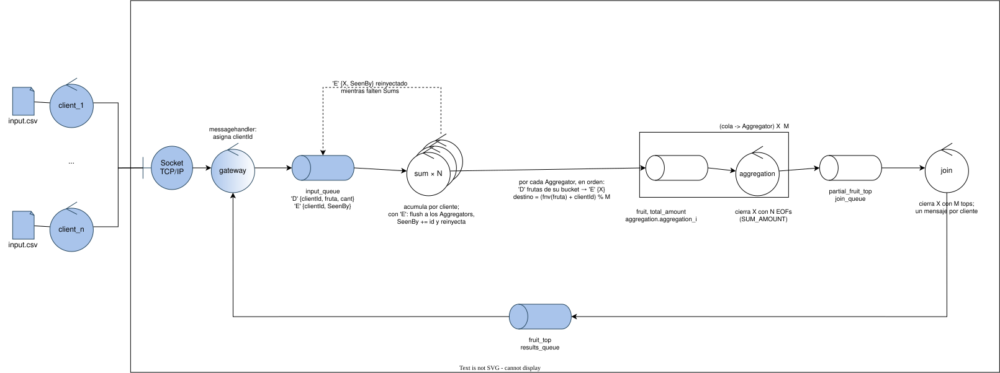
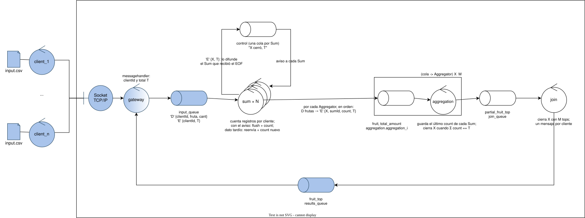

# TP Coordinación
Este informe explica las decisiones interesantes que se tomaron y por qué. 

## Arquitectura
La arquitectura no fue cambiada de la original (a nivel controladores). 
- `input_queue` y `results_queue` son las del gateway. 
- Los Sums consumen `input_queue` como working queue (se reparten las tareas), y el Join publica en `results_queue`.
- Entre Sum y Aggregation hay un exchange direct. Cada Aggregator tiene su routing key, `{AGGREGATION_PREFIX}_{ID}`, y su propia cola.

## Protocolo interno

Cada mensaje es: byte de opcode seguido de un JSON. 

```
Opcode D -> DataMessage{ClientId, Records}

Opcode E -> EOFMessage{ClientId, SeenBy}
```
De esta manera, se distingue claramente un top parcial vacío de un EOF. 

El EOF tiene el campo **SeenBy** que se utiliza para: al reencolar el EOF, anotarse a uno como que ya lo recibio, de manera que todos los Sums puedan enviar el EOF para el Aggregator. 

Es `messagehandler` del gateway donde estan `SerializeDataMessage` que arma un **D** y `SerializeEOFMessage` que arma un **E** sin SeenBy todavia. 

## 2. Multiplexación de clientes

- Cada cliente se distingue por un **clientId** que lo asigna el `messagehandler`, porque el gateway crea un handler por conexión. 
- El id hace que los registros del cliente se diferencien de los otros clientes al pasar por los controladores y al ser agregado al final. 
- Todos los nodos guardan el estado por cliente y lo borran al cerrar ese cliente. Así varios clientes se procesan sin mezclarse, y la memoria no crece infinitamente.

## 3. Coordinación del EOF entre Sums

Este fue el problema que mas me dejo pensando durante el desarrollo. 
El problema es que como `input_queue` reparte tareas a los Sums, solamente uno recibe el EOF de un cliente. Los demás pueden tener sumas parciales de ese cliente y no se enteran de que terminó. A parte de que los Aggregators esperan los avisos de todos los Sums. 

Las alternativas que descarte, despues de tener conversaciones con compañeros (no de la materia) y comparar los pros y contras: 
- **Exchange de control con broadcast del EOF**.
El aviso (el control) viaja por otra conexión que los datos, así que puede llegar antes que un dato ya entregado y todavía no procesado. Perdes el orden de llegada. 
Para intentar mitigar ese riesgo, pense en que podia esperar esos N mensajes de prefetch y estar segura que si habia mas mensajes del cliente, ya hubiera pasado. En caso de que "no lleguen mas mensajes", un timeout razonable. De la nada, pareciera que el correcto funcionamiento del sistema dependia de que configure muy bien tanto el prefetch como el timeout para mitigar casos borde. 
Despues otras ideas, pero no me encantaron como llevar un contador pero sabia que eso implicaba modificar los Aggregators que son el punto de "union". 

La solución que mas me convencio (en su momento, ahora no): reinyectar el EOF en `input_queue`, marcando los Sums que ya lo procesaron.
```
Sum x recibe 'E' {ClientId: Y, SeenBy}:
    si x ∈ SeenBy → lo reenvía sin cambios a input_queue
    si no         → flush de Y a los Aggregators, SeenBy += k,
                    y si faltan Sums lo reinyecta
```

Lo positivo: obviamente todos los registros de X ya estan encolados antes que su EOF, entonces cada reinyeccion del EOF va al final. Lo bueno de que reciban los datos y el control en el mismo canal es que no hay carrera.
Lo negativo: un sum que ya vio el EOF lo reenvia, pero nada garantiza que el siguiente que lo reciba sea de los que faltan. 
Para que no sea tan grave, volvi a poner el prefetch = 1. Pero entiendo que la mejor solucion es sin prefetch. 

#### Implementacion 
 



Algo que estuve pensando es que es una mala solución la que plantie, pero ya es tarde para implementarlo. Pero voy a desarollarla en texto una que me parece mejor, y apreciaria el feedback: 
Creo que el problema fue fijarme (solamente) a la idea de los EOFs, porque otra idea que nace es basarte en contadores. 
El messagehadnler en el EOF agrega el total de mensajes del cliente. 
Mantendria el exchange de control, y en vez de contar los prefetch, lo que haria seria hacer que todos envien sus parciales a los Aggregators y su conteo del cliente. 
En el caso que algun Sum siga con un dato tardio (lo sabria al llevar cuenta de los clientes que ya "cerro"), se lo manda al Aggregator y reenvia el conteo a todos los Aggregators. ¿Por que no avanzaria? 
Cada Aggregator guarda el conteo de cada Sum y solamente cierra cuando da el total, por ende lo esperaria. 

#### Propuesta 




## 4. Sum -> Agregator

- Cada fruta de un cliente va a un solo Aggregator, por ende tiene el total de esa fruta, así que su top parcial es correcto. 
- Se suma el `clientId` al hash para que si el reparto por fruta queda desparejo, el Aggregator más cargado no sea siempre el mismo -> con muchos clientes, la carga se empareja.
- Un middleware por Aggregator.`Send` publica a todas las keys del middleware, así que Sum crea un middleware de una sola key por cada Aggregator. Una mejora que me quedo atras, es implementar `SendTo(key, msg)`: Sum en vez de M middlewares, tiene uno creado con las M keys, y elige a quién mandarle. 
- Por cada Aggregator va un solo **D** con todas sus frutas del cliente y después su **E**
- El EOF va a todos los Aggregators, un Sum no sabe a cuáles les mandaron frutas los otros Sums, y un Aggregator sin frutas igual tiene que mandar su top.

## 5. Aggregator y Join: esperar a todas las entradas

- Aggregator cuenta EOFs por cliente. Arma el top cuando recibió `SUM_AMOUNT` EOFs de ese cliente, y entonces borra su estado. 
- El top parcial hace de EOF. Aggregator manda un solo mensaje por cliente, así que no hace falta un EOF aparte.
- Join cuenta tops parciales. Cuando recibió `AGGREGATION_AMOUNT` tops de un cliente, ordena, corta en `TOP_SIZE` y manda.

## 6. Escalabilidad

- El estado es por cliente y se libera al terminar, así que varios clientes se procesan en paralelo sin interferir.
- Los mensajes de control por cliente (EOFs, tops) no dependen de la cantidad de registros. Cada Sum le manda a cada Aggregator como mucho un **D** y un **E** por cliente, así que el tráfico Sum → Aggregation crece con la cantidad de frutas distintas, no con la cantidad de registros. Podriamos decir que hay una cantidad limitada de frutas. 
- Los Sums escalan por working queue y los Aggregators por partición del hash. El control por cliente es O(N × M) mensajes de EOF entre Sums y Aggregators, más los EOFs reinyectados (al menos N) y M tops. Claramente, si escalas los controladores, empeora con el prefetch y va a romperse este diseño. Ademas, de que seria cada vez mas dificil con mas Sums que se repartan los EOFs por la input_queue. 

## 7. Middleware

- `StartConsuming` es bloqueante y mantiene el mutex durante el inicio hasta guardar el **id** del consumer (el estado del consumer es solo **id**, protegido por un mutex). Un `StopConsuming` concurrente espera el lock y siempre encuentra un **id** para cancelar. De esta manera, un SIGTERM durante el arranque no se pierde. 
- Stop o desconexión: Si el canal sigue abierto fue un stop y se devuelve `nil` pero si se cerró, se perdió la conexión y se devuelve `ErrMessageMiddlewareDisconnected`.
- Colas del exchange: Tienen un nombre fijo derivado del exchange y las keys, y las declara el consumidor. Cada Aggregator usa su propia key (para no compartirla).
- Prefetch 1. Cada consumidor tiene como mucho un mensaje entregado sin ack. La realidad es que no esta buena la solución ya que se sustenta con este prefetch para mitigar las reinyecciones de EOF constantes (porque otros que ya la recibieron la siguen recibiendo, mientras que los que faltan, no). 

## 8. Shutdown

- El SIGTERM lo maneja cada nodo. El `shutdown.StopConsumingOnSignal` registra la señal, llama a `StopConsuming`.
- El mensaje en curso termina. `Cancel` no corta el callback, así que un envio de Sum a mitad de camino se completa antes de salir. 
- Se cierran todos los middlewares (`defer closeAll()`) y devuelve el error de `StartConsuming`. Se sale con 0 si fue un stop y con 1 si hubo error.

### Mejoras 
- Cambiaria a la nueva propuesta definitivamente. 
- Implementaria el Send por Key, de manera de reutilizar un middleware para multiples keys. 